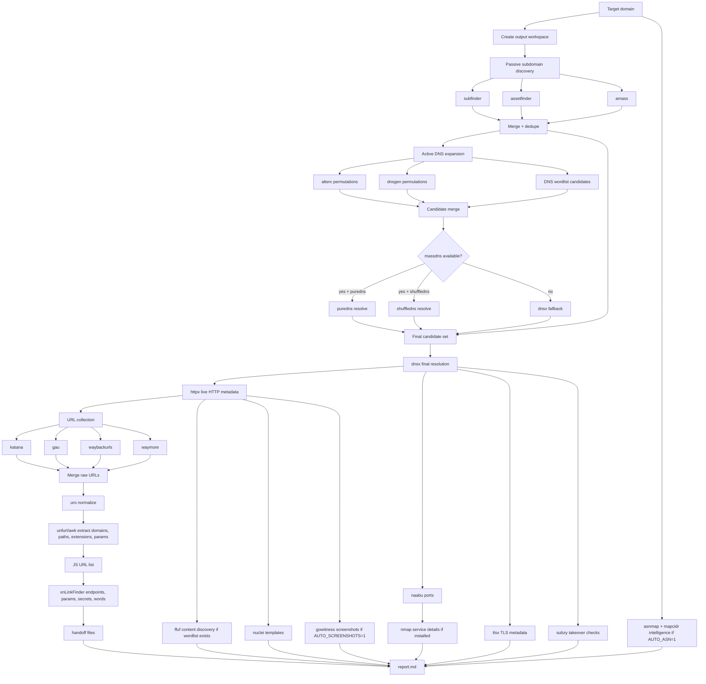
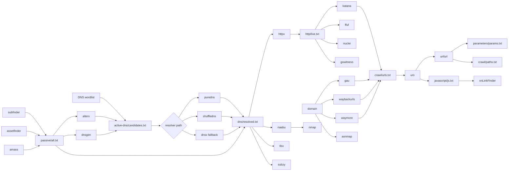

Every penetration test and CTF box starts the same way: figure out what's actually there before you start poking at it. Subdomains, live hosts, exposed ports, old JS bundles with forgotten endpoints, directories nobody bothered to lock down. The individual tools for all of this are excellent and mostly free: `subfinder`, `httpx`, `katana`, `naabu`, `nuclei`, and a long tail of others. The annoying part was never the tools. It was gluing them together, remembering the right flags for each one, and not losing three hours of subdomain enumeration because a laptop went to sleep mid-scan.

That's what `recon.sh` is for. It's a single bash script, with no framework and no external dependencies beyond the security tools it orchestrates, that runs a full recon pipeline against one domain, resumes automatically if it gets interrupted, degrades gracefully when a tool isn't installed, and ends with a Markdown report plus a curated set of handoff files for whatever manual testing comes next.

## What it actually does

The script's own `--help` output is the fastest way to see the shape of it:

```text
$ ./recon.sh --help
recon.sh - full recon automation for authorized targets

Usage:
  ./recon.sh example.com
  ./recon.sh example.com --fresh
  ./recon.sh example.com --dry-run
  ./recon.sh example.com --self-test
  ./recon.sh example.com --output /path/to/output

Default behavior:
  Runs the full recon flow and resumes existing output automatically.
  Screenshots are off unless AUTO_SCREENSHOTS=1.

Flow:
  subfinder + assetfinder + amass
    -> optional alterx/dnsgen active DNS expansion
    -> dnsx / puredns / shuffledns resolver path
    -> httpx
    -> katana + gau + waybackurls + waymore
    -> uro
    -> JS + params + paths via unfurl when available
    -> xnLinkFinder
    -> optional ffuf content discovery when a wordlist exists
    -> optional ASN/CIDR intelligence when AUTO_ASN=1
    -> naabu + nmap when nmap exists
    -> tlsx when tlsx exists
    -> gowitness only when AUTO_SCREENSHOTS=1
    -> subzy when subzy exists
    -> nuclei
    -> report
```

Under the hood that flow is twelve stages, and between the required and optional tools it touches, the script's own tool-coverage report counts 26 distinct external binaries: 11 it refuses to run without (`subfinder`, `assetfinder`, `amass`, `dnsx`, `httpx`, `katana`, `gau`, `uro`, `naabu`, `nuclei`, `xnLinkFinder`), and 15 more it uses opportunistically if they happen to be installed.

### Pipeline Architecture



### Tool Data Flow



## A few stages worth zooming into

Most of the pipeline is "run tool, save output, move on," but a handful of stages have real logic behind them.

**DNS resolution picks its own engine.** Passive enumeration hands off a candidate list, and the script decides how to resolve it based on what's actually installed:

```bash
if massdns_ready && have_cmd puredns && resolver="$(find_resolvers_file)"; then
  log "Resolving active DNS candidates with puredns + massdns"
  # fastest path: puredns backed by massdns
elif massdns_ready && have_cmd shuffledns && resolver="$(find_resolvers_file)"; then
  log "Resolving active DNS candidates with shuffledns + massdns"
  # fallback: shuffledns backed by massdns
else
  log "Resolving active DNS candidates with dnsx"
  # always-available fallback
fi
```

`puredns` and `shuffledns` are both much faster than plain `dnsx` once you're resolving tens of thousands of permutations, but they need `massdns` on the backend. Rather than hard-requiring it, the script just picks the best available path and logs which one it used, so the report always says exactly how a given run resolved its hosts.

**Port scanning is deliberately two-phase.** `naabu` does a fast top-ports sweep across every resolved host first. Only after that does `nmap` get involved, and only against the specific host:port pairs `naabu` actually found, not a blind re-scan of everything:

```bash
awk -F: '
  NF >= 2 {
    host=$1; port=$NF
    if (ports[host] == "") ports[host]=port
    else ports[host]=ports[host] "," port
  }
  END { for (host in ports) print host "\t" ports[host] }
' "$NAABU_OUT" | sort > "$NMAP_TARGETS"
```

That keeps the slow, heavier `-sV` service-detection pass scoped to ports that are actually open, instead of paying nmap's per-port cost across a whole subdomain list.

**Content discovery is capped on purpose.** `ffuf` runs against at most `FFUF_MAX_HOSTS` (default 30) live targets, `FFUF_JOBS` (default 3) at a time, each with its own per-job time limit. On a scope with a few thousand subdomains, unbounded directory brute-forcing on every single host is how a recon run turns into a multi-day job, so the script prioritizes a bounded slice instead of trying to be exhaustive everywhere.

## Design decisions I'm actually proud of

**Resumability isn't a flag you have to remember; it's the default.** Every stage function starts with a check like this:

```bash
ready() {
  [ -s "$1" ]
}

should_skip() {
  local file label
  file="$1"
  label="$2"
  if [ "$RESUME" -eq 1 ] && ready "$file"; then
    log "Skipping $label; found $(count_lines "$file") lines"
    return 0
  fi
  return 1
}
```

If a stage already produced non-empty output, re-running the exact same command just skips straight past it. That means a killed SSH session, a sleeping laptop, or a rate-limited API halfway through amass doesn't cost you the whole run: you just run the same command again. `--fresh` is there for when you actually want to start over.

**Timeouts wrap every long-running tool, with a fallback for machines that don't have `timeout`.** GNU coreutils' `timeout` isn't guaranteed to exist everywhere (stock macOS, for one), so the wrapper tries that first, falls back to `gtimeout`, and if neither is available, hand-rolls the same behavior:

```bash
run_with_timeout() {
  local seconds pid killer rc
  seconds="$1"; shift

  if [ -z "$seconds" ] || ! printf '%s\n' "$seconds" | grep -Eq '^[0-9]+$' || [ "$seconds" -eq 0 ]; then
    "$@"; return "$?"
  fi

  if have_cmd timeout; then timeout "$seconds" "$@"; return "$?"; fi
  if have_cmd gtimeout; then gtimeout "$seconds" "$@"; return "$?"; fi

  "$@" &
  pid="$!"
  (
    sleep "$seconds"
    kill -0 "$pid" 2>/dev/null || exit 0
    kill_process_tree TERM "$pid"
    sleep 5
    kill_process_tree KILL "$pid"
  ) &
  killer="$!"

  wait "$pid"; rc="$?"
  kill "$killer" 2>/dev/null || true
  wait "$killer" 2>/dev/null || true

  [ "$rc" -eq 143 ] || [ "$rc" -eq 137 ] && return 124
  return "$rc"
}
```

The manual path backgrounds the command, races a killer subshell that sends `TERM` and escalates to `KILL` after a grace period, and normalizes the exit code to `124` either way, so every call site can treat "124" as "this timed out," regardless of which of the three paths actually fired. `--no-timeouts` zeroes every per-tool timeout variable at once, which routes straight into that first early-return branch and just lets things run unbounded.

A couple of stages go further and layer an inner limit inside an outer one. `xnLinkFinder` gets its own `-mtl 10` (10-minute internal cap) and an outer `run_with_timeout` of 660 seconds, providing 60 seconds of slack in case the tool's own limit doesn't fire cleanly. `nmap` does the same thing with `--host-timeout 180s` inside a 210-second outer wrapper. It's a small pattern, but it shows up more than once, which is usually a sign it was a deliberate choice rather than an accident.

Skipping `errexit` is deliberate. With 26 external tools involved, treating every non-zero exit as fatal would mean one flaky DNS lookup kills a two-hour run. Instead, almost every tool call captures its own `rc="$?"` and decides individually whether that's a `warn` (log it, write an empty file, keep going) or a `die` (abort, because nothing downstream can work without this stage).

**Missing tools degrade instead of crashing.** Everything past the 11 required tools is gated behind `have_cmd`:

```bash
if ! have_cmd ffuf; then
  warn "ffuf not found; skipping content discovery"
  : > "$FFUF_SUMMARY"
  return 0
fi
```

At the end of a run, `stage_missing_tools_report` writes out exactly which of the 26 tools were present and what each one would have added, so a run on a stripped-down CI container still produces a complete, honest report instead of quietly having gaps you'd only discover later.

**Wordlists fall back sanely instead of failing.** `find_dns_wordlist` and `find_ffuf_wordlist` check a handful of common SecLists install paths first. If none exist, `ensure_builtin_wordlists` generates a small built-in list on the fly so the script still works out of the box, while warning you that results will be thinner than they would be with SecLists actually installed.

**Independent stages run in parallel.** The three passive enumeration tools kick off together and get joined with a small helper that reports pass/fail per job without aborting the whole run:

```bash
run_subfinder & p1="$!"
run_assetfinder & p2="$!"
run_amass & p3="$!"
wait_labeled "$p1" subfinder "$p2" assetfinder "$p3" amass || true
```

Later, once HTTP probing finishes, seven more stages (URL collection, ffuf, ports, nuclei, TLS, takeover checks, and ASN lookups) all launch in the background at once, since none of them depend on each other. URL processing and JS analysis wait specifically on the crawl stage, because they need its output, but everything else that only depends on the live-host list runs concurrently.

## Where everything ends up

Output lands in a per-target directory that mirrors the pipeline stage by stage:

```text
<domain>/recon/
├── passive/         subfinder, assetfinder, amass output + merged list
├── active-dns/      alterx/dnsgen/wordlist candidates + resolved hosts
├── dns/             final candidate + resolved host list
├── http/            httpx live hosts + JSON metadata
│   └── screenshots/ gowitness output, if enabled
├── crawl/           katana/gau/waybackurls/waymore + normalized URLs
├── javascript/      JS URLs, xnLinkFinder endpoints/params/secrets
├── parameters/      extracted parameter names
├── ports/           naabu output
│   └── nmap/        per-host nmap reports
├── asn/             asnmap CIDRs, raw and aggregated
├── tls/             tlsx certificate metadata + SAN names
├── takeovers/       subzy results
├── ffuf/            per-host ffuf JSON + summary
├── nuclei/          JSONL findings + flattened text
├── handoff/         curated files for the next round of manual testing
├── wordlists/       built-in fallback wordlists, if used
├── reports/         summary.md + missing-tools.md
└── logs/            stdout/stderr for every single tool call
```

The `handoff/` directory is the one I actually use the most day to day. It's not raw tool output; it's a small, curated set of files meant to feed straight into manual testing: a clean list of live hosts, every parameter name discovered across crawling and JS analysis, a JS-derived wordlist you can point back at content discovery, and a filtered list of URLs matching extensions worth a second look (`.zip`, `.sql`, `.env`, `.bak`, `.config`, and similar). Everything else is there if you need to dig in, but `handoff/` is where I actually start.

## Dry-run and self-test, before touching a real target

`--dry-run` prints the exact execution plan (which tools are installed, which wordlists and resolvers it found, which DNS resolution engine it would pick) without sending a single packet. It's the first thing I run on a new machine, before pointing the script at anything real.

`--self-test` goes a step further and fabricates synthetic data through every stage (fake subdomains, fake httpx JSON, a fake nuclei finding) so the report generation, directory layout, and handoff files can all be sanity-checked end to end without ever touching the network. Useful after editing the script itself, or just to confirm a fresh clone actually works before an engagement starts.

## Using it

```bash
# Full run against a target you're authorized to test
./recon.sh example.com

# Ignore prior output and re-run everything from scratch
./recon.sh example.com --fresh

# See the plan without touching the network
./recon.sh example.com --dry-run

# Validate the whole pipeline with synthetic data
./recon.sh example.com --self-test

# Tune concurrency and cut nuclei down to high-signal findings
THREADS=80 NUCLEI_SEVERITY=high,critical ./recon.sh example.com

# Write output somewhere specific
./recon.sh example.com --output /data/engagements/example
```

Most of the tuning happens through environment variables rather than flags, such as `DNS_RATE`, `HTTP_RATE`, `NAABU_RATE`, and `NUCLEI_RATE` to throttle how hard each tool hits the target, `KATANA_DEPTH` to control crawl depth, and `FFUF_MAX_HOSTS` / `FFUF_JOBS` / `FFUF_THREADS` to bound content discovery. Anything you don't set just uses the defaults baked into the script.

## Scope and authorization, always

Every stage of this pipeline is loud. Depending on the target, a full run is anywhere from thousands to hundreds of thousands of DNS queries, HTTP requests, port probes, and template checks. None of that is subtle, and none of it is legal against infrastructure you don't own or don't have explicit permission to test. Security engagements publish scope for a reason; CTFs hand you a defined target for a reason. `recon.sh` doesn't enforce that at runtime; it just says so once, at the top of its own help text, so it's on whoever's running it to only ever point it at scope they're actually authorized to touch.

## Wrapping up

None of the individual pieces here are novel: every tool this script calls is a well-known name in the recon space, and there are other public frameworks that do similar orchestration. What made this worth building for me was less about any single tool and more about the plumbing: not losing progress on a bad connection, knowing exactly what ran and what didn't, and ending up with a report and a `handoff/` folder I can actually start working from instead of a pile of loose text files scattered across a dozen tool output formats.

The full script is up on my GitHub at [recon.sh](https://github.com/ABHIGYAN-MOHANTA/recon.sh) if you want to run it yourself or adapt pieces of it for your own setup.

<nav className="article-series-nav">
	<a className="nav-prev" href="/blog/mitigating-slowloris-go-websockets/">
		<span className="nav-label">Previous</span>
		<span className="nav-title">« Mitigating Slowloris in Go</span>
	</a>
	<a className="nav-next" href="/blog">
		<span className="nav-label">Finish</span>
		<span className="nav-title">Back to All Articles »</span>
	</a>
</nav>
